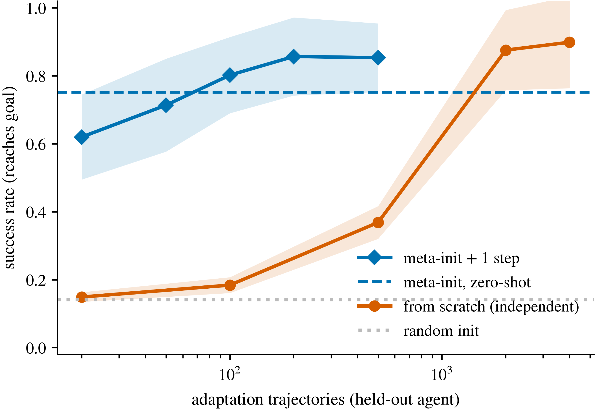

# Per-FedAvg-PG: Personalized Federated RL via MAML

[](https://github.com/AliBeikmohammadi/Per-FedAvg-PG/actions)
[](https://www.python.org/)
[](LICENSE)
[](https://arxiv.org/abs/XXXX.XXXXX)

Reference implementation and experiment suite for **Personalized Federated
Reinforcement Learning via Model-Agnostic Meta-Learning: Convergence of Exact
and Hessian-Free Meta-Policy Gradients**. The paper studies personalized
federated RL: a population of agents, each acting in its own MDP, collaborate
through a server to learn a shared policy *initialization* that becomes good
for an individual agent after a single local policy-gradient adaptation step.
We call the method **Per-FedAvg-PG** and prove non-asymptotic convergence
rates for both an exact and a Hessian-free (first-order) meta-policy-gradient
variant.

This repository reproduces every figure and claim in the paper. It's pure
NumPy + Matplotlib — no GPU, no external services — and every run is seeded
across 10 seeds for exact reproducibility.

<p align="center">
  <br>
  <em>Headline result (E5): a first-order meta-initialization transfers to
  <b>unseen</b> agents at 75% task success zero-shot, rising to ~86% after one
  adaptation step, and beats independent from-scratch training by ~4–5x at a
  matched adaptation budget.</em>
</p>

## Overview

The experiments are split across two environments, each carrying a distinct
share of the argument:

* **Tabular** finite gridworlds give the objective `F` and its gradient
  `grad F` *exactly*, via dynamic programming — no evaluation noise. These
  isolate claims about the objective, the gradient estimator, and the
  step-size dependence.
* **Neural** navigation (a `d≈360`-parameter MLP policy) has weights shared
  across agents, so it's the only place personalization and transfer can
  actually happen. It probes what matters in practice: the curvature
  bottleneck in the exact meta-gradient, and few-shot generalization to
  agents unseen during training.

## Requirements

* Python 3.9+
* `numpy>=1.24`, `matplotlib>=3.6` — no GPU required.

## Installation

```bash
git clone https://github.com/AliBeikmohammadi/Per-FedAvg-PG
cd Per-FedAvg-PG
pip install -e .          # or: pip install -r requirements.txt
```

## Quick start

```bash
make test        # correctness + determinism checks (fast)
make figures     # regenerate all figures from the committed results/ (seconds)
make all         # rerun every experiment from scratch, then figures
```

Scripts can also be called directly — see `Makefile` and `reproduce.sh`. Each
`scripts/e*.py` module documents, in its docstring, exactly which experiment
and which theorem it validates.

## Experiments

| Figure | What it shows | Script |
|--------|-----------|--------|
| `fig_e1_personalization` | Personalization within a federation (tabular, exact evaluation) | `e1e2_tabular.py` |
| `fig_e3_alpha` | The adaptation-step-size knob and its `α → 0` recovery of non-personalized FedAvg (tabular) | `e3_alpha.py` |
| `fig_e4_curvature` | The curvature bottleneck vs. Hessian-batch size `m_h` (neural) | `e4_curvature_neural.py` |
| `fig_e5_fewshot` | Few-shot adaptation on held-out agents — return (neural) | `e5_fewshot_neural.py` |
| `fig_e5_success` | Few-shot adaptation on held-out agents — task success (neural), headline result | `e5_fewshot_neural.py` |
| `fig_e6_learning` | Return vs. communication round (tabular) | `e1e2_tabular.py` |
| `fig_e7_trajectories` | Held-out rollouts before/after adaptation (neural) | `e7_trajectories_neural.py` |

## Repository structure

```
per_fedavg_pg/    gridworld.py, neural.py, tasks.py   — the importable library
scripts/          e1e2_tabular, e3_alpha, e4_curvature_neural,
                  e5_fewshot_neural, e7_trajectories_neural, make_figures
results/          committed, merged *.npz — lets figures reproduce without rerunning
figures/          generated *.pdf + *.png
run_tests.py, reproduce.sh, Makefile, pyproject.toml, LICENSE, CITATION.cff
```

## Reproducibility

* Every RNG is seeded. `run_tests.py` checks that repeated seeds give
  identical results in both environments, and that exact and finite-difference
  gradients agree to ~1e-8.
* The committed `results/*.npz` files (five, merged) let `make figures`
  reproduce every plot exactly, without rerunning any experiment.
* Each script's `CFG` block holds its exact settings: 10 seeds throughout;
  `K=80` rounds tabular, `K=150` neural; E4 sweeps the Hessian batch
  `m_h ∈ {10, 50, 100, 200, 500, 1000}`; E5 sweeps the adaptation batch
  `{0, 20, 50, 100, 200, 500}` (0 = zero-shot).
* **Cost note.** The neural E4 sweep scales with `m_h`; the `m_h=1000` chunk
  at 10 seeds is the expensive one (up to a couple of hours). E4 is chunked
  (`e4_curvature_neural.py <m_h>`, then `merge`) and resumable, so large-`m_h`
  chunks can run in parallel or in the background. Everything else — all
  tabular experiments and figure generation — is fast.

## Citation

If you use this code, please cite the accompanying paper (see
[`CITATION.cff`](CITATION.cff)).

## License

MIT — see [`LICENSE`](LICENSE).
